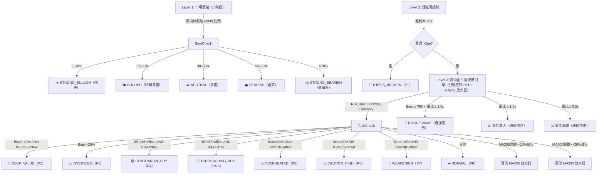
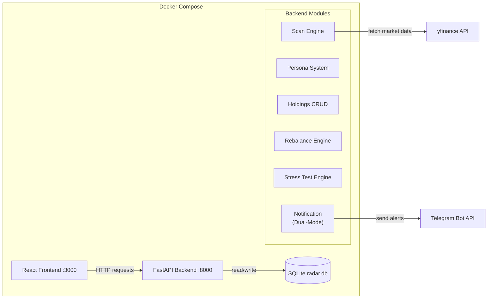
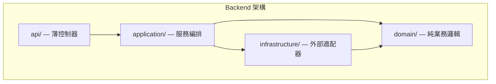

# Folio — 智能資產配置

[](https://github.com/azusa152/azusa-stock/actions/workflows/ci.yml)

> 不是教你買什麼，而是幫你建立一套**有紀律的觀察流程** — 記錄觀點、追蹤訊號、自動提醒，讓你不再憑感覺做決定。

一套**自架的個人投資追蹤系統**，把「盯盤」這件事自動化。分類管理你關注的股票，定時掃描技術面與基本面異常，有狀況直接推 Telegram 通知。Docker 一鍵部署，輕量不吃資源，跑在任何有 Docker 的機器上都行。

## 目錄

- [功能特色](#功能特色)
- [核心邏輯](#核心邏輯)
- [技術架構](#技術架構)
- [快速開始](#快速開始)
- [開發與 CI](#開發與-ci)
- [安全性](#安全性-security)
- [API 參考](#api-參考)
- [OpenClaw 整合](#openclaw-整合)
- [專案結構（Clean Architecture）](#專案結構clean-architecture)
- [日誌管理](#日誌管理)

## 功能特色

### 追蹤與分類

- **五大分類** — 風向球 / 護城河 / 成長夢想 / 債券 / 現金
- **多市場支援** — 美股、台股、日股、港股，自動帶入市場後綴與幣別
- **觀點版控** — 每次更新觀點自動遞增版號，完整保留歷史演進
- **動態標籤** — 為股票標記領域標籤（AI、Cloud、SaaS...），標籤隨觀點版控一併快照
- **財報日曆與股息** — 自動顯示下次財報日期（14 天倒數提醒）、殖利率與除息日

### 掃描與訊號

- **V2 三層漏斗掃描** — 市場情緒 → 護城河趨勢 → 技術面訊號 → 自動產生決策燈號
- **恐懼與貪婪指數** — 結合 VIX 與 CNN Fear & Greed 的綜合市場情緒指標（五級），日股用戶另提供 **Nikkei VI（日經波動指數）** 作為 JP 市場恐懼指標，台股用戶另提供 **^TWII 實現波動率** 作為 TW 市場恐懼指標
- **護城河健檢** — 毛利率 5 季走勢圖 + YoY 五級診斷
- **即時訊號燈號** — 股票卡片標題顯示最新掃描訊號（🚨💎📉🟢🎯🔥⚠️🔻➖），9 級分類感知 RSI 閾值（Growth/Moat/Bond 依 beta 動態調整），MA200 放大器自動升級邊緣訊號
- **掃描歷史** — 持久化每次掃描結果，可查看個股時間軸與連續異常次數
- **瘋狗浪偵測 (Rogue Wave)** — 比對當前乖離率與個股 3 年歷史百分位，乖離率 ≥ P95 且量比 ≥ 1.5x 時觸發警示；疊加於既有訊號之上，股票卡片顯示 🌊 警示 Banner

### 通知與警報

- **自訂價格警報** — 為個股設定 RSI / 價格 / 乖離率門檻，觸發時 Telegram 即時通知
- **智慧定時掃描** — 每 30 分鐘檢查資料新鮮度，僅推播差異通知，避免重複掃描
- **每週摘要** — 每週日自動發送豐富投資組合報告（總市值 WoW + S&P 500 Alpha + 健康分數 + 本週漲跌前三名 + 異常訊號 + 配置偏移 + Smart Money 大師動態）
- **雙模式通知** — 系統預設 Bot 或自訂 Bot Token，兩種 Telegram 發送模式

### 資產配置

- **War Room** — 6 種投資人格範本、三種資產類型持倉管理、多幣別匯率轉換、再平衡分析、聰明提款
- **購買匯率快照 & FX 報酬拆解** — 新增持倉時自動記錄當下匯率（`purchase_fx_rate`），持倉明細同時顯示**本幣報酬**（本地股價漲跌 + 匯率影響）與**匯率報酬**，完整呈現跨幣別投資的真實損益
- **壓力測試** — 模擬大盤崩盤情境（-50% 至 0%），基於 CAPM Beta 計算各持倉預期損失與痛苦等級（微風輕拂 / 有感修正 / 傷筋動骨 / 睡不著覺），檢視投資組合抗跌能力
- **穿透式持倉 X-Ray** — 自動解析 ETF 成分股，計算直接+間接真實曝險，超門檻自動警告
- **匯率曝險監控** — 現金/全資產幣別雙分頁檢視，三層級匯率變動偵測（單日 / 5日 / 3月），Telegram 警報
- **外匯換匯時機監控** — 完整的換匯時機管理系統：
  - 支援 9 種主要貨幣（USD、TWD、JPY、EUR、GBP、CNY、HKD、SGD、THB），任意貨幣對組合
  - 雙重偵測機制：近期高點警報（可調回溯天數 5-90 日）+ 連續上漲警報（可調門檻 2-10 日）
  - 即時換匯建議欄位：分析表格直接顯示建議（🟢 建議換匯 / ⚪ 暫不換匯），含詳細理由說明
  - 互動式趨勢圖表：3 個月歷史匯率折線圖，期間選擇（1M/2M/3M），參考線標示近期高點，顏色編碼趨勢方向
  - 彈性警報控制：獨立啟用/停用兩種偵測條件（OR 邏輯），自訂冷卻時間（1-168 小時）避免重複通知
  - 一鍵操作：內嵌切換啟用/停用按鈕、刪除按鈕，手動檢查（不發通知）、立即發送 Telegram 警報
- **隱私模式** — 一鍵遮蔽金額與數量，設定儲存於資料庫，跨裝置同步
- **持倉-雷達自動同步** — 新增持倉時自動帶入雷達分類，省去重複操作
- **聰明提款機** — War Room Step 5 提供互動式提款表單，輸入金額與幣別即可取得賣出建議；Liquidity Waterfall 三層優先演算法（再平衡超配 → 節稅 → 流動性），避免隨便賣掉表現最好的股票

### 大師足跡追蹤 (Smart Money)

- **SEC 13F 季報追蹤** — 匯入任意機構投資人 SEC CIK，一鍵同步最新 13F 持倉快照（波克夏、橋水、文藝復興等）
- **持倉異動儀表板** — 按動作分組（新建倉 / 清倉 / 加碼 / 減碼），含市值、股數、變動幅度與持倉權重
- **前 10 大持倉圖表** — 互動式水平長條圖 + 明細表，以顏色標示持倉動作
- **英雄所見略同 (Great Minds Think Alike)** — 自動比對追蹤清單 / 持倉與所有大師 13F 持股，找出共鳴個股
- **共鳴徽章** — 投資雷達頁面股票卡片自動標記 🏆×N 徽章，揭示大師持有重疊
- **儀表板共鳴摘要** — 首頁一眼看出哪些持倉與大師觀點重疊

### 介面與操作

- **五頁面架構** — 投資組合總覽（儀表板）、投資雷達（追蹤掃描）、個人資產配置（War Room）、外匯監控、大師足跡
- **雷達市場篩選器** — 當追蹤清單涵蓋多個市場（美股 + 台股 + 日股 + 港股）時，雷達頁面自動顯示市場篩選藥丸，一鍵只看指定市場的股票
- **多語言支援 (i18n)** — 支援繁體中文、English、日本語、简体中文，可在側邊欄切換語言，設定自動儲存
- **投資組合總覽** — 市場情緒、恐懼貪婪指數、總市值、健康分數、YTD TWR、配置圓餅圖、Drift 長條圖、訊號警報（即時 computed_signal，與雷達頁一致）、歷史績效折線圖（多期間選擇 + 基準疊加 + 迷你走勢圖）、持倉含成本/報酬欄位、YTD 股息估算
- **日漲跌追蹤** — 投資組合總市值與個股均顯示日漲跌幅，數據來自 yfinance 歷史資料（前一交易日 vs. 當日收盤價）
- **拖曳排序** — drag-and-drop 調整顯示順位，寫入資料庫持久化
- **移除與封存** — 移除股票時記錄原因，封存至「已移除」分頁，支援重新啟用
- **匯出 / 匯入** — JSON 格式匯出觀察名單，Dashboard 上傳或 CLI 腳本匯入
- **本地時間顯示** — 自動偵測瀏覽器時區，資料更新時間以本地時間呈現
- **內建 SOP 指引** — Dashboard 內附操作說明書

## 核心邏輯

### 分類與掃描規則

| 分類 | 說明 | Layer 1 參與 |
|------|------|:------------:|
| **風向球 (Trend Setter)** | 大盤 ETF、巨頭，觀察資金流向與 Capex（ETF 不參與情緒計算） | 是 |
| **護城河 (Moat)** | 供應鏈中不可替代的賣鏟子公司 | 否 |
| **成長夢想 (Growth)** | 高波動、具想像空間的成長股 | 否 |
| **債券 (Bond)** | 國債、投資等級債券 ETF | 否 |
| **現金 (Cash)** | 閒置現金（手動輸入，不進行訊號掃描） | 否 |

### V2 三層漏斗



## 技術架構



- **Backend** — FastAPI + SQLModel，負責 API、資料庫、掃描邏輯
- **Frontend** — React (Vite + TypeScript + shadcn/ui + Tailwind) 五頁面 SPA（總覽 + 雷達 + 資產配置 + 外匯監控 + 大師足跡）
- **Database** — SQLite，透過 Docker Volume 持久化
- **資料來源** — yfinance，含多層快取、速率限制與自動重試機制
- **啟動快取預熱** — 後端啟動時非阻塞式背景預熱 L1/L2 快取（技術訊號、護城河、恐懼貪婪指數、ETF 成分股、Beta 值），前端首次載入即命中暖快取
- **通知** — Telegram Bot API 雙模式，支援差異通知、價格警報、每週摘要
- **再平衡引擎** — 比較目標配置 vs 實際持倉，產生偏移分析與再平衡建議
- **壓力測試引擎** — 基於 CAPM Beta 模擬大盤崩盤情境，計算投資組合預期損失與痛苦等級（線性模型：Loss = Market Drop × Beta），含分類別 Beta 回退機制
- **匯率曝險引擎** — 分離現金/全資產幣別分佈，偵測顯著匯率變動
- **聰明提款引擎** — Liquidity Waterfall 三層優先演算法（再平衡 → 節稅 → 流動性），純函式設計可獨立測試

## 快速開始

### 前置需求

- [Docker Desktop](https://www.docker.com/products/docker-desktop/) 已安裝並啟動
- Python 3（僅限本機執行匯入腳本時需要）

### 語言設定 (i18n)

Folio 支援多語言介面，預設為繁體中文：

| 語言 | Language Code |
|------|---------------|
| 🇹🇼 繁體中文 | `zh-TW` (default) |
| 🇺🇸 English | `en` |
| 🇯🇵 日本語 | `ja` |
| 🇨🇳 简体中文 | `zh-CN` |

**切換語言：**
- 在前端側邊欄選擇「🌐 Language」
- 選擇偏好語言，設定會自動儲存到資料庫
- 所有 UI 文字與 Telegram 通知訊息都會切換為所選語言

### 1. 設定環境變數

編輯專案根目錄的 `.env` 檔案，填入 Telegram Bot 憑證：

```env
TELEGRAM_BOT_TOKEN=your-telegram-bot-token-here
TELEGRAM_CHAT_ID=your-telegram-chat-id-here
```

> 若不需要 Telegram 通知，保留預設值即可，系統會自動跳過發送。
>
> **雙模式通知**：除了 `.env` 環境變數（系統預設 Bot），你也可以在「💼 個人資產配置 → 📡 Telegram 設定」分頁中設定自訂 Bot Token 與 Chat ID。啟用後，所有掃描通知、價格警報、每週摘要都會透過自訂 Bot 發送。

<details>
<summary>📖 Telegram Bot 申請與設定教學（點擊展開）</summary>

#### Step 1：透過 BotFather 建立 Bot

1. 在 Telegram 搜尋 **@BotFather**，點擊開始對話。
2. 傳送 `/newbot`。
3. 依照提示輸入：
   - **Bot 名稱**（顯示名稱，例如 `Folio`）
   - **Bot 帳號**（唯一 ID，必須以 `bot` 結尾，例如 `folio_invest_bot`）
4. 建立成功後，BotFather 會回覆一段訊息，其中包含 **HTTP API Token**，格式類似：
   ```
   123456789:ABCdefGHI-jklMNOpqrSTUvwxYZ
   ```
5. 將這段 Token 複製，填入 `.env` 的 `TELEGRAM_BOT_TOKEN`。

> 如需更改 Bot 的頭像或描述，可對 BotFather 傳送 `/mybots` 進行設定。

#### Step 2：取得你的 Chat ID

**個人聊天（推薦）：**

1. 在 Telegram 搜尋 **@userinfobot**，點擊開始對話。
2. 傳送 `/start`，Bot 會回覆你的使用者資訊，其中 `Id` 即為你的 Chat ID（純數字）。
3. 將此數字填入 `.env` 的 `TELEGRAM_CHAT_ID`。

**群組聊天：**

1. 將你的 Bot 加入目標群組。
2. 在群組中隨意傳送一則訊息。
3. 在瀏覽器中開啟以下網址（將 `<TOKEN>` 替換為你的 Bot Token）：
   ```
   https://api.telegram.org/bot<TOKEN>/getUpdates
   ```
4. 在回傳的 JSON 中找到 `"chat":{"id":-123456789}`，該負數即為群組 Chat ID。
5. 將此數字填入 `.env` 的 `TELEGRAM_CHAT_ID`。

#### Step 3：填寫 `.env` 並驗證

```env
TELEGRAM_BOT_TOKEN=123456789:ABCdefGHI-jklMNOpqrSTUvwxYZ
TELEGRAM_CHAT_ID=987654321
```

填好後可用以下指令快速驗證 Bot 是否能正常發送訊息：

```bash
curl -s "https://api.telegram.org/bot<YOUR_TOKEN>/sendMessage" \
  -d chat_id=<YOUR_CHAT_ID> \
  -d text="Hello from Folio!"
```

若收到 Telegram 訊息，代表設定成功。

> 參考：`.env.example` 中已列出所有可用的環境變數。

</details>

### 2. 啟動服務

```bash
docker compose up --build
```

- **Backend API** — http://localhost:8000（Swagger 文件：http://localhost:8000/docs）
- **Frontend Dashboard** — http://localhost:3000
- **Scanner** — Alpine cron 容器，啟動時立即檢查資料新鮮度（`GET /scan/last`），僅在上次掃描超過 30 分鐘時觸發 `POST /scan`；每週日 18:00 UTC 發送週報（`POST /digest`）；每 6 小時觸發外匯警報；**申報季（Feb/May/Aug/Nov）每日同步 13F**，非申報季每週同步一次（`POST /gurus/sync`）

> **啟動快取預熱**：Backend 啟動後會自動在背景預熱 L1/L2 快取（技術訊號、護城河、恐懼貪婪指數、ETF 成分股、Beta 值），不影響 API 回應速度。前端首次載入即可命中暖快取，無需等待 yfinance 即時查詢。

### 3. 匯入觀察名單

**方式一：Dashboard UI 上傳**

在左側面板「📤 匯入觀察名單」區塊上傳 JSON 檔案，點擊確認即可匯入。

**方式二：CLI 腳本**

```bash
# 建立虛擬環境（首次）
python3 -m venv .venv
source .venv/bin/activate
pip install requests

# 匯入預設觀察名單
python scripts/import_stocks.py

# 或指定自訂 JSON 檔案
python scripts/import_stocks.py path/to/custom_list.json
```

> 兩種方式皆支援 upsert：若股票已存在，會自動更新觀點與標籤（版控遞增）。

<details>
<summary>📄 匯入 JSON 檔案格式（點擊展開）</summary>

```json
[
  {
    "ticker": "NVDA",
    "category": "Moat",
    "thesis": "你對這檔股票的觀點。",
    "tags": ["AI", "Semiconductor"]
  }
]
```

- `ticker` — 股票代號（美股）
- `category` — 分類，必須是 `Trend_Setter`、`Moat`、`Growth`、`Bond`、`Cash` 之一
- `thesis` — 初始觀點
- `tags` — 領域標籤（選填，預設為空陣列）

</details>

### 4. 升級與資料管理

#### 升級服務（安全，保留資料）

```bash
docker compose up --build -d
```

容器內建的 entrypoint 腳本會自動處理權限問題，無需額外操作。從舊版（root 使用者）升級時，系統會自動修正檔案所有權。

#### 備份與還原資料庫

```bash
# 備份資料庫到 ./backups/
make backup

# 還原最新備份
make restore

# 還原特定備份檔案
make restore FILE=backups/radar-20260214_153022.db
```

#### 完全重置（清空所有資料）

```bash
# ⚠️ 警告：這會刪除所有資料！建議先備份
make backup

# 刪除 Docker volumes 並重建
docker compose down -v
docker compose up --build
```

`-v` 會移除 Docker Volume（含 `radar.db`），重啟後自動建立空白資料庫。

### 5. API 型別產生（OpenAPI Codegen）

前端 TypeScript 型別由後端 OpenAPI 規格自動產生，避免手動維護導致型別不一致。

```bash
# 首次完整設定（安裝後端 + 前端依賴，並產生型別）
make setup

# 修改 backend/api/schemas/ 後重新產生型別
make generate-api
```

- `frontend-react/src/api/openapi.json`（已提交）— API 契約，可在 PR 中審查
- `frontend-react/src/api/types/generated.d.ts`（gitignored）— 建構時自動產生，不提交至版本控制

CI 流程（GitHub Actions）會自動驗證 `openapi.json` 是否與後端保持同步，並確認前端可正常編譯。本地可執行 `make check-api-spec` 進行相同驗證。

### 6. 依賴管理（pip-tools）

後端使用 [pip-tools](https://pip-tools.readthedocs.io/) 管理 Python 依賴，確保可重現建構：

- **`backend/requirements.in`** — 直接依賴，寬鬆版本約束（編輯此檔）
- **`backend/requirements.txt`** — 自動產生的鎖定檔，包含所有遞移依賴的精確版本（請勿手動編輯）

```bash
# 新增或修改依賴後，重新解析鎖定檔
make lock

# 升級所有依賴至最新相容版本
make upgrade
```

> 兩個檔案都需要提交至 Git。Docker 建構時使用鎖定檔安裝，確保每次建構結果一致。

## 開發與 CI

```bash
# 首次安裝依賴（含 pip-audit 等開發工具）
make install

# 完整 CI 檢查 — 鏡像所有 GitHub CI 流程，本地通過即代表 CI 不會失敗
make ci

# 個別步驟
make test          # 所有測試（backend pytest + frontend Vitest）
make lint          # Lint（ruff + ESLint）
make format        # 格式化 backend 程式碼
make check-api-spec      # 驗證 OpenAPI spec 與 backend 保持同步
make backend-security    # pip-audit 後端漏洞掃描
make frontend-security   # npm audit 前端高危漏洞掃描
make check-constants     # 驗證 backend/frontend 常數同步
make check-ci            # 驗證 make ci 覆蓋所有 GitHub CI job
```

**`make ci` 覆蓋的 GitHub CI 流程：**

| GitHub CI Job | 對應的 make 指令 |
|---|---|
| Backend Tests | `backend-test` |
| Lint (ruff) | `backend-lint` |
| OpenAPI Spec Freshness | `check-api-spec` |
| Frontend Lint | `frontend-lint` |
| Frontend Build | `frontend-build` |
| Frontend Tests | `frontend-test` |
| Frontend Security (npm audit) | `frontend-security` |
| Backend/Frontend Constant Sync | `check-constants` |
| Security Audit (pip-audit) | `backend-security` |
| CI Gate | (aggregates all jobs above — blocks PR merge on failure) |

<details>
<summary>手動執行（不使用 Make）</summary>

```bash
cd backend
python3 -m venv .venv
source .venv/bin/activate   # Windows: .venv\Scripts\activate
pip install -r requirements.txt

LOG_DIR=/tmp/folio_test_logs DATABASE_URL="sqlite://" python -m pytest tests/ -v --tb=short
```

</details>

> 測試使用 in-memory SQLite，所有外部服務（yfinance、Telegram）皆已 mock，不需要網路連線。
> CI 環境（GitHub Actions）會在每次 push / PR 時自動執行，詳見 `.github/workflows/ci.yml`。
> **Merge Protection:** `CI Gate` 是 GitHub branch protection 的唯一必要狀態檢查。任何 CI job 失敗都會阻止 PR 合併。設定路徑：GitHub repo → Settings → Branches → Branch protection rules → `main` → Require status checks → 加入 `CI Gate`。

## 安全性 (Security)

Folio 採用多層次安全防護，確保資料安全與系統穩定性。

### API 認證 (API Authentication)

**生產模式：** 透過 `X-API-Key` header 驗證所有 API 請求。

```bash
# 1. 生成 API Key（使用 Makefile）
make generate-key

# 2. 將 Key 加入 .env（專案根目錄）
FOLIO_API_KEY=your-generated-key-here

# 3. 重啟服務
docker compose up --build -d
```

**範例請求：**

```bash
# 正確：攜帶 X-API-Key header
curl -H "X-API-Key: your-generated-key-here" http://localhost:8000/summary

# 錯誤：未攜帶 header → 401 Unauthorized
curl http://localhost:8000/summary
```

**開發模式：** 若 `FOLIO_API_KEY` 未設定，API 認證自動停用（dev mode），無需額外設定。

> **重要提示：** OpenClaw 或其他 AI agent 整合時，需在 webhook 設定中加入 `X-API-Key` header。詳見 [OpenClaw 整合](#openclaw-整合) 章節。

### 資料加密 (Data Encryption)

**Telegram Bot Token 加密：** 使用 Fernet 對稱式加密（AES-128-CBC + HMAC-SHA256）保護自訂 Bot Token，防止資料庫明文洩漏。

```bash
# 1. 生成加密金鑰
python -c "from cryptography.fernet import Fernet; print(Fernet.generate_key().decode())"

# 2. 將 Key 加入 .env（專案根目錄）
FERNET_KEY=your-generated-fernet-key-here

# 3. 重啟服務（自動加密既有 Token）
docker compose up --build -d
```

> **注意：** `FERNET_KEY` 必須妥善保管與備份。遺失此 Key 將無法解密資料庫中的 Token。開發模式（未設定 `FERNET_KEY`）會以明文儲存 Token 並顯示警告日誌。

### 安全機制

- **速率限制** — 掃描、Webhook、Digest 端點限制 5 次/分鐘（每 IP），防止濫用與 yfinance 過載
- **輸入驗證** — 批次匯入限制 1000 筆，檔案上傳限制 5MB，Pydantic 型別驗證防止注入攻擊
- **錯誤遮蔽** — API 錯誤訊息不洩漏內部實作細節，僅回傳標準化 `error_code` 與通用訊息
- **Docker 隔離** — 容器內使用非 root 使用者執行服務，限縮攻擊面
- **隱私模式** — 前端一鍵遮蔽金額、數量、Chat ID，設定持久化至資料庫
- **依賴掃描** — CI 使用 `pip-audit` + `npm audit` 檢查已知 CVE；本地可執行 `make backend-security`（pip-audit）與 `make frontend-security`（npm audit）
- **敏感資料防護** — `.gitignore` 排除資料庫檔案（`*.db`）、環境變數（`.env`）、日誌檔案（`logs/`）

### 安全最佳實務

1. **定期更新依賴** — 執行 `make upgrade` 將所有依賴重新鎖定為最新相容版本，再 `make install` 安裝
2. **備份加密金鑰** — 將 `FERNET_KEY` 儲存於密碼管理器或安全 vault
3. **限制網路曝露** — 生產環境建議使用 reverse proxy（Nginx/Caddy）搭配 HTTPS
4. **監控異常** — 定期檢查 `logs/radar.log`，注意重複 403 或 429 錯誤

---

## API 參考

完整互動式文件請見 [Swagger UI](http://localhost:8000/docs)。以下列出常用端點：

| Method | Path | 說明 |
|--------|------|------|
| `POST` | `/ticker` | 新增追蹤股票（含初始觀點與標籤） |
| `GET` | `/stocks` | 取得所有追蹤股票（含 `last_scan_signal` 持久化訊號） |
| `POST` | `/scan` | V2 三層漏斗掃描（9 級訊號燈號，分類感知 RSI + MA200 放大器），僅推播差異通知 |
| `GET` | `/summary` | 純文字投資組合摘要（AI agent 適用，含總值 + 日漲跌 + 前三名 + 偏移 + Smart Money） |
| `POST` | `/webhook` | 統一入口 — 供 OpenClaw 等 AI agent 使用 |
| `GET` | `/rebalance` | 再平衡分析（含 X-Ray 穿透式持倉） |
| `GET` | `/snapshots` | 歷史投資組合快照（`?days=30` 或 `?start=&end=`） |
| `GET` | `/snapshots/twr` | 時間加權報酬率（YTD 或自訂日期範圍） |
| `POST` | `/snapshots/take` | 手動觸發當日快照建立 |

<details>
<summary>📋 完整 API 端點列表（點擊展開）</summary>

| Method | Path | 說明 |
|--------|------|------|
| `GET` | `/health` | Health check（Docker 健康檢查用） |
| `POST` | `/ticker` | 新增追蹤股票（含初始觀點與標籤） |
| `GET` | `/stocks` | 取得所有追蹤股票（DB 資料，含 `last_scan_signal` 持久化訊號） |
| `PUT` | `/stocks/reorder` | 批次更新股票顯示順位 |
| `GET` | `/stocks/export` | 匯出所有股票（JSON 格式，含觀點與標籤） |
| `POST` | `/stocks/import` | 批次匯入股票（JSON body，upsert 邏輯） |
| `GET` | `/stocks/removed` | 取得所有已移除股票 |
| `GET` | `/ticker/{ticker}/signals` | 取得單一股票的技術訊號（yfinance，含快取） |
| `GET` | `/ticker/{ticker}/moat` | 護城河健檢（毛利率 5 季走勢 + YoY 診斷） |
| `GET` | `/ticker/{ticker}/earnings` | 取得下次財報日期（快取 24 小時） |
| `GET` | `/ticker/{ticker}/dividend` | 取得股息殖利率與除息日 |
| `GET` | `/ticker/{ticker}/scan-history` | 取得個股掃描歷史（含訊號與時間） |
| `POST` | `/ticker/{ticker}/thesis` | 新增觀點（自動版控 version +1，含標籤） |
| `GET` | `/ticker/{ticker}/thesis` | 取得觀點版控歷史 |
| `PATCH` | `/ticker/{ticker}/category` | 切換股票分類 |
| `POST` | `/ticker/{ticker}/deactivate` | 移除追蹤（含移除原因） |
| `POST` | `/ticker/{ticker}/reactivate` | 重新啟用已移除股票（可更新分類與觀點） |
| `GET` | `/ticker/{ticker}/removals` | 取得移除歷史 |
| `POST` | `/ticker/{ticker}/alerts` | 建立自訂價格警報（metric / operator / threshold） |
| `GET` | `/ticker/{ticker}/alerts` | 取得個股的所有價格警報 |
| `DELETE` | `/alerts/{id}` | 刪除價格警報 |
| `POST` | `/scan` | V2 三層漏斗掃描（9 級訊號燈號，非同步，分類感知 RSI + MA200 放大器），僅推播差異通知 |
| `GET` | `/market/fear-greed` | 取得恐懼與貪婪指數（VIX + CNN 綜合分析，含各來源明細） |
| `GET` | `/scan/last` | 取得最近一次掃描時間戳與市場情緒（供 smart-scan 判斷資料新鮮度，含 F&G） |
| `GET` | `/scan/history` | 取得最近掃描紀錄（跨股票） |
| `POST` | `/digest` | 觸發每週投資組合摘要（非同步），結果透過 Telegram 推播 |
| `GET` | `/summary` | 純文字投資組合摘要（專為 AI agent / chat 設計，含總值 + 日漲跌 + 前三名 + 配置偏移 + Smart Money） |
| `GET` | `/snapshots` | 歷史投資組合快照清單，支援 `?days=30`（1–730）或 `?start=YYYY-MM-DD&end=YYYY-MM-DD` |
| `GET` | `/snapshots/twr` | 計算指定期間的時間加權報酬率（TWR），支援 `?start=&end=`，預設 YTD |
| `POST` | `/snapshots/take` | 手動觸發當日投資組合快照（背景執行，upsert 語意） |
| `POST` | `/webhook` | 統一入口 — 供 OpenClaw 等 AI agent 使用 |
| `GET` | `/personas/templates` | 取得系統預設投資人格範本 |
| `GET` | `/profiles` | 取得目前啟用的投資組合配置 |
| `POST` | `/profiles` | 建立新的投資組合配置 |
| `PUT` | `/profiles/{id}` | 更新投資組合配置 |
| `DELETE` | `/profiles/{id}` | 停用投資組合配置 |
| `GET` | `/holdings` | 取得所有持倉 |
| `POST` | `/holdings` | 新增持倉（含可選 broker / currency 欄位） |
| `POST` | `/holdings/cash` | 新增現金持倉 |
| `PUT` | `/holdings/{id}` | 更新持倉 |
| `DELETE` | `/holdings/{id}` | 刪除持倉 |
| `GET` | `/holdings/export` | 匯出持倉（JSON） |
| `POST` | `/holdings/import` | 匯入持倉 |
| `GET` | `/rebalance` | 再平衡分析（目標 vs 實際 + 建議 + X-Ray 穿透式持倉），支援 `?display_currency=TWD` 指定顯示幣別 |
| `POST` | `/rebalance/xray-alert` | 觸發 X-Ray 分析並發送 Telegram 集中度風險警告 |
| `POST` | `/withdraw` | 聰明提款建議（Liquidity Waterfall），支援 `display_currency` 指定幣別、`notify` 控制 Telegram 通知 |
| `GET` | `/stress-test` | 壓力測試分析（scenario_drop_pct: -50 至 0，display_currency），回傳組合 Beta、預期損失、痛苦等級、各持倉明細 |
| `GET` | `/ticker/{ticker}/price-history` | 取得股價歷史（前端趨勢圖用） |
| `GET` | `/settings/telegram` | 取得 Telegram 通知設定（token 遮蔽） |
| `PUT` | `/settings/telegram` | 更新 Telegram 通知設定（支援自訂 Bot） |
| `POST` | `/settings/telegram/test` | 發送 Telegram 測試訊息 |
| `GET` | `/settings/preferences` | 取得使用者偏好設定（隱私模式等） |
| `PUT` | `/settings/preferences` | 更新使用者偏好設定（upsert） |
| `GET` | `/fx-watch` | 取得所有外匯監控配置（支援 `?active_only=true` 篩選啟用中） |
| `POST` | `/fx-watch` | 新增外匯監控配置（base_currency / quote_currency / 近期高點天數 / 連續上漲門檻 / 近期高點警報開關 / 連續上漲警報開關 / 提醒間隔） |
| `PATCH` | `/fx-watch/{id}` | 更新外匯監控配置（可選更新任意欄位） |
| `DELETE` | `/fx-watch/{id}` | 刪除外匯監控配置 |
| `POST` | `/fx-watch/check` | 檢查所有外匯監控（分析結果，不發送 Telegram） |
| `POST` | `/fx-watch/alert` | 檢查外匯監控並發送 Telegram 警報（帶冷卻機制） |
| `POST` | `/admin/cache/clear` | 清除所有後端快取（L1 記憶體 + L2 磁碟） |
| `GET` | `/docs` | Swagger UI（互動式 API 文件） |
| `GET` | `/openapi.json` | OpenAPI 規範（JSON） |
| `GET` | `/gurus` | 取得所有追蹤大師清單 |
| `POST` | `/gurus` | 新增自訂大師（name / cik / display_name） |
| `DELETE` | `/gurus/{guru_id}` | 停用大師追蹤 |
| `POST` | `/gurus/sync` | 觸發所有大師 13F 同步（SEC EDGAR，帶 mutex 防重複） |
| `POST` | `/gurus/{guru_id}/sync` | 觸發單一大師 13F 同步 |
| `GET` | `/gurus/{guru_id}/filing` | 取得大師最新 13F 申報摘要（基準日 / 公告日 / 總市值 / 持倉數） |
| `GET` | `/gurus/{guru_id}/holdings` | 取得大師所有持倉（含動作標籤：NEW/SOLD/INCREASED/DECREASED/UNCHANGED） |
| `GET` | `/gurus/{guru_id}/top` | 取得大師前 N 大持倉（按權重排序，預設 N=10） |
| `GET` | `/resonance` | 取得投資組合共鳴總覽（所有大師 vs 觀察清單/持倉的重疊） |
| `GET` | `/resonance/{ticker}` | 取得特定股票的大師持有情況 |

</details>

<details>
<summary>🧪 curl 範例集（點擊展開）</summary>

### 新增股票（含標籤）

```bash
curl -X POST http://localhost:8000/ticker \
  -H "Content-Type: application/json" \
  -d '{"ticker": "NVDA", "category": "Moat", "thesis": "賣鏟子給巨頭的王。", "tags": ["AI", "Semiconductor"]}'
```

### 更新觀點（含標籤）

```bash
curl -X POST http://localhost:8000/ticker/NVDA/thesis \
  -H "Content-Type: application/json" \
  -d '{"content": "GB200 需求超預期，上調目標價。", "tags": ["AI", "Semiconductor", "Hardware"]}'
```

### 觸發掃描

```bash
curl -X POST http://localhost:8000/scan
```

### 建立價格警報

```bash
# 當 NVDA 的 RSI < 30 時通知
curl -X POST http://localhost:8000/ticker/NVDA/alerts \
  -H "Content-Type: application/json" \
  -d '{"metric": "rsi", "operator": "lt", "threshold": 30}'
```

### 重新啟用已移除股票

```bash
curl -X POST http://localhost:8000/ticker/ZM/reactivate \
  -H "Content-Type: application/json" \
  -d '{"category": "Growth", "thesis": "重新觀察串流通訊商機。"}'
```

### 批次匯入股票

```bash
curl -X POST http://localhost:8000/stocks/import \
  -H "Content-Type: application/json" \
  -d '[{"ticker":"AAPL","category":"Moat","thesis":"品牌護城河","tags":["Hardware"]}]'
```

### 建立投資組合配置（從人格範本）

```bash
# 查看可用範本
curl -s http://localhost:8000/personas/templates | python3 -m json.tool

# 從 "balanced" 範本建立配置
curl -X POST http://localhost:8000/profiles \
  -H "Content-Type: application/json" \
  -d '{"name": "標準型", "source_template_id": "balanced", "config": {"Trend_Setter": 25, "Moat": 30, "Growth": 15, "Bond": 20, "Cash": 10}}'
```

### 新增持倉

```bash
# 新增美股持倉（broker、currency 為選填，currency 預設 USD）
curl -X POST http://localhost:8000/holdings \
  -H "Content-Type: application/json" \
  -d '{"ticker": "NVDA", "category": "Moat", "quantity": 50, "cost_basis": 120.0, "broker": "Firstrade", "currency": "USD"}'

# 新增台股持倉（指定 TWD 幣別）
curl -X POST http://localhost:8000/holdings \
  -H "Content-Type: application/json" \
  -d '{"ticker": "2330.TW", "category": "Moat", "quantity": 100, "cost_basis": 580.0, "broker": "永豐金", "currency": "TWD"}'

# 新增現金持倉
curl -X POST http://localhost:8000/holdings/cash \
  -H "Content-Type: application/json" \
  -d '{"currency": "TWD", "amount": 100000}'
```

### 再平衡分析

```bash
# 預設以 USD 為顯示幣別
curl -s http://localhost:8000/rebalance | python3 -m json.tool

# 以 TWD 為顯示幣別（所有資產換算為台幣）
curl -s "http://localhost:8000/rebalance?display_currency=TWD" | python3 -m json.tool

# X-Ray 穿透式持倉分析（解析 ETF 成分股，計算真實曝險）
# 回傳 xray 陣列包含每個標的的 direct_weight_pct + indirect_weight_pct
curl -s http://localhost:8000/rebalance | python3 -c "
import json, sys
data = json.load(sys.stdin)
for e in data.get('xray', [])[:10]:
    print(f\"{e['symbol']:6s} 直接:{e['direct_weight_pct']:5.1f}% 間接:{e['indirect_weight_pct']:5.1f}% 真實:{e['total_weight_pct']:5.1f}%\")
"

# 觸發 X-Ray Telegram 警告（超過 15% 門檻的標的）
curl -s -X POST "http://localhost:8000/rebalance/xray-alert?display_currency=USD"
```

### 聰明提款（Smart Withdrawal）

```bash
# 「我需要 50,000 TWD 去旅遊，該賣哪個？」
curl -s -X POST http://localhost:8000/withdraw \
  -H "Content-Type: application/json" \
  -d '{"target_amount": 50000, "display_currency": "TWD", "notify": true}' | python3 -m json.tool

# 透過 Webhook 呼叫（適用 AI agent / OpenClaw）
curl -s -X POST http://localhost:8000/webhook \
  -H "Content-Type: application/json" \
  -d '{"action": "withdraw", "params": {"amount": 50000, "currency": "TWD"}}'
```

### 清除後端快取（Admin）

```bash
# 清除所有後端快取（L1 記憶體 × 10 + L2 磁碟），適用於快取資料過期但 TTL 未到的情況
curl -X POST http://localhost:8000/admin/cache/clear
# => {"status":"ok","l1_cleared":10,"l2_cleared":true}
```

### 設定自訂 Telegram Bot

```bash
# 更新 Telegram 設定（啟用自訂 Bot）
curl -X PUT http://localhost:8000/settings/telegram \
  -H "Content-Type: application/json" \
  -d '{"telegram_chat_id": "123456789", "custom_bot_token": "YOUR_BOT_TOKEN", "use_custom_bot": true}'

# 發送測試訊息
curl -X POST http://localhost:8000/settings/telegram/test
```

</details>

## OpenClaw 整合

<details>
<summary>🤖 OpenClaw AI Agent Gateway 設定（點擊展開）</summary>

[OpenClaw](https://docs.openclaw.ai/) 是一個開源 AI agent gateway，讓你可以透過 WhatsApp、Telegram、Discord 等即時通訊工具與 Folio 互動。

### 前置需求

```bash
npm install -g openclaw@latest
openclaw onboard
```

確保 OpenClaw Gateway 正在運行，且 Folio 的 Docker Compose 服務已啟動。

### 設定方式

**方式一：使用 Skill 檔案**

將 `docs/agents/folio/` 資料夾複製到 OpenClaw skills 目錄：

```bash
cp -r docs/agents/folio/ ~/.openclaw/skills/folio/
```

**方式二：使用 AGENTS.md**

將 `docs/agents/AGENTS.md` 複製到 OpenClaw workspace：

```bash
cp docs/agents/AGENTS.md ~/.openclaw/workspace/AGENTS.md
```

### Agent-Friendly Endpoints

| Endpoint | 用途 |
|----------|------|
| `GET /summary` | 純文字投資組合摘要，適合 chat 回覆 |
| `POST /webhook` | 統一入口，接受 `{"action": "...", "ticker": "...", "params": {}}` |
| `GET /openapi.json` | 自動生成的 OpenAPI 規範 |
| `GET /docs` | Swagger UI 互動式文件 |

### Webhook Actions

| Action | 說明 | 需要 ticker |
|--------|------|:-----------:|
| `summary` | 投資組合健康摘要 | 否 |
| `signals` | 單一股票技術指標 | 是 |
| `scan` | 觸發全域掃描 | 否 |
| `moat` | 護城河分析 | 是 |
| `alerts` | 查看價格警報 | 是 |
| `add_stock` | 新增股票 | 是（在 params 中） |

### 範例對話（透過 WhatsApp/Telegram/Discord）

| 你說... | Agent 執行... |
|---------|---------------|
| 「目前投資組合狀況如何」 | `curl http://localhost:8000/summary` |
| 「幫我查 NVDA 的技術指標」 | `POST /webhook {"action":"signals","ticker":"NVDA"}` |
| 「執行一次全域掃描」 | `POST /webhook {"action":"scan"}` |
| 「新增 AMD 到護城河分類」 | `POST /webhook {"action":"add_stock","params":{"ticker":"AMD","category":"Moat","thesis":"..."}}` |

### 相關連結

- [OpenClaw 文件](https://docs.openclaw.ai/)
- [Skills 設定](https://docs.openclaw.ai/tools/skills)
- [Tools 設定](https://docs.openclaw.ai/tools)
- [Cron Jobs](https://docs.openclaw.ai/automation/cron-jobs)

</details>

---

## 專案結構（Clean Architecture）

後端採用 Clean Architecture 四層架構，依賴方向由外向內，各層職責明確：

```
azusa-stock/
├── backend/       # FastAPI + SQLModel（domain / application / infrastructure / api / tests）
├── frontend-react/ # React + Vite SPA（總覽 + 雷達 + 資產配置 + 外匯監控 + 大師足跡）
├── scripts/       # 匯入腳本 + OpenClaw 設定
└── docker-compose.yml
```



| 層 | 目錄 | 子套件 | 職責 | 依賴 |
|----|------|--------|------|------|
| **Domain** | `domain/` | `core/` · `analysis/` · `portfolio/` | 純業務規則、計算、列舉。不依賴框架，可獨立單元測試。 | 無 |
| **Application** | `application/` | `stock/` · `scan/` · `portfolio/` · `guru/` · `messaging/` · `settings/` | Use Case 編排：協調 Repository 與 Adapter 完成業務流程。 | Domain, Infrastructure |
| **Infrastructure** | `infrastructure/` | `market_data/` · `persistence/` · `external/` | 外部適配器：DB、yfinance、Telegram。可替換不影響業務。 | Domain |
| **API** | `api/` | `routes/` · `schemas/` | 薄控制器：解析 HTTP 請求 → 呼叫 Service → 回傳回應。 | Application |

<details>
<summary>📁 完整專案目錄結構（點擊展開）</summary>

```
azusa-stock/
├── .env                              # Telegram Bot 憑證
├── .env.example                      # 環境變數範本
├── .dockerignore                     # Docker build 排除清單
├── .gitignore
├── .cursorrules                      # Cursor AI 架構師指引
├── docker-compose.yml                # Backend + Frontend + Scanner 服務定義
├── README.md
│
├── backend/
│   ├── Dockerfile
│   ├── requirements.in               # 直接依賴（寬鬆約束，手動編輯）
│   ├── requirements.txt              # 鎖定檔（pip-compile 自動產生，勿手動編輯）
│   ├── main.py                       # 進入點：建立 App、註冊路由
│   ├── logging_config.py             # 集中式日誌（跨層共用）
│   │
│   ├── domain/                       # 領域層：純業務邏輯，無框架依賴
│   │   ├── core/                     #   基礎類型子套件
│   │   │   ├── constants.py          #     集中管理閾值、快取設定、共用訊息
│   │   │   ├── enums.py              #     分類、狀態列舉 + 常數
│   │   │   ├── entities.py           #     SQLModel 資料表 (Stock, ThesisLog, ScanLog, PriceAlert, UserPreferences...)
│   │   │   ├── protocols.py          #     MarketDataProvider Protocol
│   │   │   └── formatters.py         #     訊號格式化工具
│   │   ├── analysis/                 #   分析子套件
│   │   │   ├── analysis.py           #     純計算：RSI, Bias, 決策引擎, compute_twr（可獨立測試）
│   │   │   ├── fx_analysis.py        #     外匯風險分析
│   │   │   └── smart_money.py        #     Smart Money 共鳴計算
│   │   ├── portfolio/                #   投資組合子套件
│   │   │   ├── rebalance.py          #     純計算：再平衡 drift 分析（可獨立測試）
│   │   │   ├── withdrawal.py         #     純計算：聰明提款 Liquidity Waterfall（可獨立測試）
│   │   │   └── stress_test.py        #     純計算：壓力測試 CAPM 模擬（可獨立測試）
│   │   └── constants.py / entities.py / ...  # 向下相容 shim（re-export 至 core/）
│   │
│   ├── application/                  # 應用層：Use Case 編排
│   │   ├── stock/                    #   股票與財報服務
│   │   ├── scan/                     #   掃描與預熱服務
│   │   ├── portfolio/                #   持倉、再平衡、壓力測試、FX 監控服務
│   │   ├── guru/                     #   大師足跡與共鳴服務
│   │   ├── messaging/                #   通知、Webhook、Telegram 設定服務
│   │   ├── settings/                 #   偏好設定、人格、快照服務
│   │   ├── services.py               #   向下相容 facade（re-export 至各子套件）
│   │   └── formatters.py             #   Telegram HTML 格式化（跨子套件共用）
│   │
│   ├── infrastructure/               # 基礎設施層：外部適配器
│   │   ├── database.py               #   SQLite engine + session 管理（根層，api/ 允許直接匯入）
│   │   ├── market_data/              #   市場資料子套件
│   │   │   ├── market_data.py        #     yfinance 適配器（含快取 + Rate Limiter + tenacity 重試）
│   │   │   ├── market_data_resolver.py #   市場與股票代號自動識別
│   │   │   ├── finmind_adapter.py    #     FinMind API 台股資料適配器
│   │   │   └── jquants_adapter.py    #     J-Quants API 日股財務資料適配器
│   │   ├── persistence/              #   持久化子套件
│   │   │   └── repositories.py       #     Repository Pattern（集中 DB 查詢，含批次操作）
│   │   ├── external/                 #   外部服務子套件
│   │   │   ├── notification.py       #     Telegram Bot 適配器（雙模式）
│   │   │   ├── sec_edgar.py          #     SEC EDGAR 13F 資料擷取
│   │   │   └── crypto.py             #     Fernet 加密工具（Bot Token 保護）
│   │   └── repositories.py / notification.py / ...  # 向下相容 shim
│   │
│   ├── config/                        # 設定檔
│   │   ├── system_personas.json      #   投資人格範本（6 種）
│   │   └── templates/                #   匯入範本 (stock / holding)
│   │
│   └── api/                          # API 層：薄控制器
│       ├── schemas/                  #   Pydantic 請求/回應 Schema 子套件
│       │   ├── common.py             #     HealthResponse 等共用 Schema
│       │   ├── stock.py              #     股票、觀點、護城河 Schema
│       │   ├── scan.py               #     掃描、價格警報 Schema
│       │   ├── portfolio.py          #     持倉、再平衡、提款、壓力測試 Schema
│       │   ├── guru.py               #     大師足跡、共鳴 Schema
│       │   ├── fx_watch.py           #     外匯監控 Schema
│       │   └── notification.py       #     Telegram、偏好設定、快照 Schema
│       ├── routes/                   #   路由子套件
│       │   ├── stock_routes.py       #     股票管理 + /summary + /webhook 路由
│       │   ├── thesis_routes.py      #     觀點版控路由
│       │   ├── scan_routes.py        #     三層漏斗掃描 + 每週摘要路由（含 mutex）
│       │   ├── snapshot_routes.py    #     /snapshots + /snapshots/twr + /snapshots/take 路由
│       │   ├── persona_routes.py     #     投資人格 + 配置 CRUD 路由
│       │   ├── holding_routes.py     #     持倉管理 + 再平衡 + 壓力測試路由
│       │   ├── telegram_routes.py    #     Telegram 通知設定路由（雙模式）
│       │   ├── preferences_routes.py #     使用者偏好設定路由（隱私模式等）
│       │   ├── fx_watch_routes.py    #     外匯監控 CRUD 路由
│       │   └── guru_routes.py        #     大師足跡路由（/gurus + /resonance，13F 同步 mutex）
│       ├── dependencies.py           #   FastAPI 依賴注入
│       └── rate_limit.py             #   速率限制中介軟體
│   │
│   └── tests/                        # 測試套件（domain / application / api / infrastructure）
│       ├── conftest.py               #   共用 fixtures（TestClient, in-memory DB, mock 外部服務）
│       ├── domain/
│       │   ├── test_stress_test.py  #   壓力測試純計算邏輯（38 tests）
│       │   └── ...                   #   其他 domain 測試
│       ├── application/
│       │   ├── test_stress_test_service.py  #   壓力測試服務編排（9 tests）
│       │   └── ...                   #   其他 application 測試
│       ├── api/
│       │   ├── routes/              #   路由測試（與 api/routes/ 結構對應）
│       │   └── ...                   #   其他 API 測試
│       └── infrastructure/
│           ├── market_data/         #   市場資料測試（與 infrastructure/market_data/ 結構對應）
│           └── ...                   #   其他 infrastructure 測試
│
├── frontend-react/
│   ├── Dockerfile                    # Multi-stage：Node build → nginx serve
│   ├── package.json
│   ├── src/
│   │   ├── api/                      # TanStack Query hooks + axios client + types（generated + hand-written）
│   │   ├── components/               # 頁面元件（allocation/{holdings,analysis,tools,settings}/, dashboard/, radar/, fxwatch/, smartmoney/）
│   │   ├── hooks/                    # useTheme, usePrivacyMode, useLanguage, usePlotlyTheme
│   │   ├── lib/                      # constants.ts、i18n.ts
│   │   └── pages/                    # Dashboard, Radar, Allocation, FxWatch, SmartMoney
│   └── public/locales/               # i18n JSON（en, zh-TW, ja, zh-CN）
│
├── scripts/
│   ├── check_constant_sync.py        # Backend/Frontend 常數同步檢查（CI + pre-commit）
│   ├── check_ci_completeness.py      # 驗證 make ci 覆蓋所有 GitHub CI job（CI + pre-commit）
│   ├── export_openapi.py             # 匯出 FastAPI OpenAPI 規格供前端 codegen 使用
│   ├── import_stocks.py              # 從 JSON 匯入股票至 API（支援 upsert）
│   ├── data/
│   │   └── folio_watchlist.json      # 預設觀察名單
│   └── openclaw/
│       ├── AGENTS.md                 # OpenClaw workspace 指令範本
│       └── folio/
│           └── SKILL.md              # OpenClaw Skill 定義檔
│
└── logs/                             # 日誌檔案（bind-mount 自動產生）
    ├── radar.log                     # 當日日誌
    └── radar.log.YYYY-MM-DD         # 歷史日誌（保留 3 天）
```

</details>

## 日誌管理

日誌檔案透過 bind-mount 映射至專案根目錄的 `logs/` 資料夾，可直接在本機存取。

```bash
# 即時追蹤日誌
tail -f logs/radar.log

# 或直接在 Cursor / VS Code 中開啟 logs/radar.log
```

**輪替規則：**
- 每日 UTC 午夜自動輪替
- 保留最近 3 天的歷史日誌，超過自動刪除
- 格式：`2026-02-09 14:30:00 | INFO     | main | 股票 TSLA 已成功新增至追蹤清單。`

**環境變數調整：**
- `LOG_LEVEL` — 日誌等級，預設 `INFO`（可設為 `DEBUG` 取得更詳細資訊）
- `LOG_DIR` — 日誌目錄，預設 `/app/data/logs`
