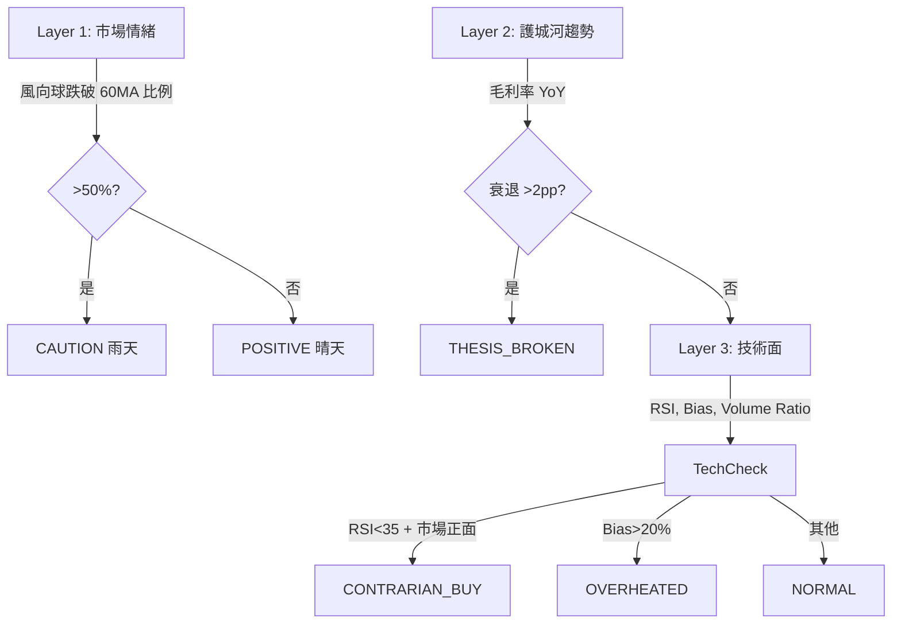
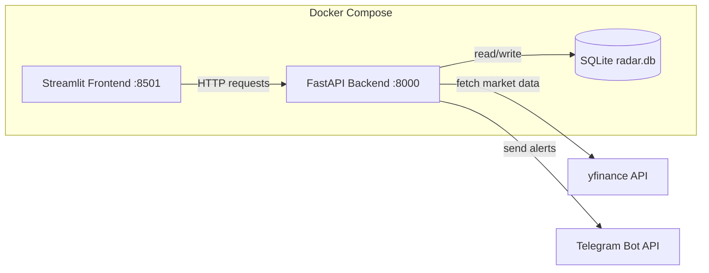
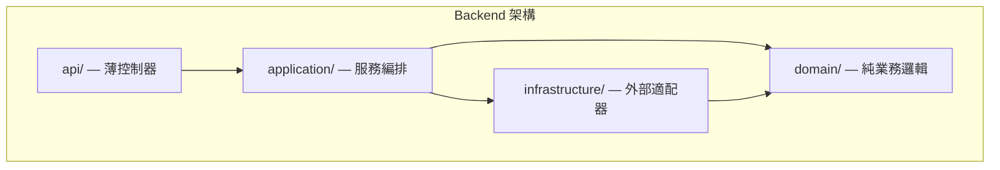

# Azusa Radar — 投資雷達

系統化追蹤股票、管理觀點演進、並透過三層漏斗自動掃描技術面與基本面異常。

## 功能特色

- **四大分類追蹤** — 風向球 / 護城河 / 成長夢想 / ETF，各類有專屬分頁
- **觀點版控 (Thesis Versioning)** — 每次更新觀點自動遞增版號，完整保留歷史演進
- **動態標籤 (Dynamic Tagging)** — 為股票標記領域標籤（AI、Cloud、SaaS...），標籤隨觀點版控一併快照
- **V2 三層漏斗掃描** — 市場情緒 → 護城河趨勢 → 技術面訊號 → 自動產生決策燈號（並行掃描 4 股同時）
- **護城河健檢** — 毛利率 5 季走勢圖 + YoY 五級診斷（護城河穩固 / 錯殺機會 / 股價偏弱 / Thesis Broken / 觀察中）
- **掃描歷史** — 持久化每次掃描結果，可查看個股掃描時間軸與連續異常次數
- **自訂價格警報** — 為個股設定 RSI / 價格 / 乖離率門檻，觸發時透過 Telegram 即時通知（4 小時冷卻）
- **財報日曆** — 自動顯示下次財報日期，14 天內倒數提醒
- **股息資訊** — 護城河與 ETF 類股票顯示殖利率與除息日
- **拖曳排序** — 透過 drag-and-drop 調整股票顯示順位，順位寫入資料庫持久化
- **移除與封存** — 移除股票時記錄原因，封存至「已移除」分頁，支援重新啟用
- **匯出 / 匯入** — JSON 格式匯出觀察名單，支援 Dashboard 上傳匯入或 CLI 腳本匯入（upsert）
- **定時掃描** — 每 30 分鐘自動執行三層漏斗掃描（非同步），僅推播「差異」通知（訊號變化時才發送）
- **每週摘要** — 每週日自動發送 Telegram 投資組合健康報告（健康分數 + 異常股票 + 本週訊號變化）
- **yfinance 速率限制** — 內建 Rate Limiter（2 次/秒），避免被 Yahoo Finance 封鎖
- **內建 SOP 指引** — Dashboard 內附操作說明書

## 核心邏輯

### 分類與掃描規則

| 分類 | 說明 | Layer 1 參與 |
|------|------|:------------:|
| **風向球 (Trend Setter)** | 大盤 ETF、巨頭，觀察資金流向與 Capex | 是 |
| **護城河 (Moat)** | 供應鏈中不可替代的賣鏟子公司 | 否 |
| **成長夢想 (Growth)** | 高波動、具想像空間的成長股 | 否 |
| **ETF** | 指數型基金，被動追蹤市場或主題 | 否 |

### V2 三層漏斗



## 技術架構



- **Backend** — FastAPI + SQLModel，負責 API、資料庫、掃描邏輯
- **Frontend** — Streamlit Dashboard，分頁顯示四類股票（+ 已移除封存）與觀點編輯
- **Database** — SQLite，透過 Docker Volume 持久化（含 ScanLog、PriceAlert 資料表）
- **資料來源** — yfinance（使用 curl_cffi 繞過 bot 防護），含 `cachetools` 記憶體快取 + Rate Limiter（2 次/秒）
- **通知** — Telegram Bot API（差異通知 + 價格警報 + 每週摘要）
- **並行掃描** — `ThreadPoolExecutor(max_workers=4)` 加速掃描，受 Rate Limiter 保護
- **拖曳排序** — `streamlit-sortables` 元件

## 快速開始

### 前置需求

- [Docker Desktop](https://www.docker.com/products/docker-desktop/) 已安裝並啟動
- Python 3（僅限本機執行匯入腳本時需要）

### 1. 設定環境變數

編輯專案根目錄的 `.env` 檔案，填入 Telegram Bot 憑證：

```env
TELEGRAM_BOT_TOKEN=your-telegram-bot-token-here
TELEGRAM_CHAT_ID=your-telegram-chat-id-here
```

> 若不需要 Telegram 通知，保留預設值即可，系統會自動跳過發送。

### 2. 啟動服務

```bash
docker compose up --build
```

- **Backend API** — http://localhost:8000（Swagger 文件：http://localhost:8000/docs）
- **Frontend Dashboard** — http://localhost:8501
- **Scanner** — Alpine cron 容器，每 30 分鐘自動掃描（`POST /scan`），每週日 18:00 UTC 發送週報（`POST /digest`）

### 3. 匯入觀察名單

**方式一：Dashboard UI 上傳**

在左側面板「📤 匯入觀察名單」區塊上傳 JSON 檔案，點擊確認即可匯入。

**方式二：CLI 腳本**

```bash
# 建立虛擬環境（首次）
python3 -m venv .venv
source .venv/bin/activate
pip install requests

# 匯入預設觀察名單
python scripts/import_stocks.py

# 或指定自訂 JSON 檔案
python scripts/import_stocks.py path/to/custom_list.json
```

> 兩種方式皆支援 upsert：若股票已存在，會自動更新觀點與標籤（版控遞增）。

### 4. 重置資料庫

```bash
docker compose down -v
docker compose up --build
```

`-v` 會移除 Docker Volume（含 `radar.db`），重啟後自動建立空白資料庫。

## API 參考

| Method | Path | 說明 |
|--------|------|------|
| `GET` | `/health` | Health check（Docker 健康檢查用） |
| `POST` | `/ticker` | 新增追蹤股票（含初始觀點與標籤） |
| `GET` | `/stocks` | 取得所有追蹤股票（僅 DB 資料） |
| `PUT` | `/stocks/reorder` | 批次更新股票顯示順位 |
| `GET` | `/stocks/export` | 匯出所有股票（JSON 格式，含觀點與標籤） |
| `POST` | `/stocks/import` | 批次匯入股票（JSON body，upsert 邏輯） |
| `GET` | `/stocks/removed` | 取得所有已移除股票 |
| `GET` | `/ticker/{ticker}/signals` | 取得單一股票的技術訊號（yfinance，含快取） |
| `GET` | `/ticker/{ticker}/moat` | 護城河健檢（毛利率 5 季走勢 + YoY 診斷） |
| `GET` | `/ticker/{ticker}/earnings` | 取得下次財報日期（快取 24 小時） |
| `GET` | `/ticker/{ticker}/dividend` | 取得股息殖利率與除息日 |
| `GET` | `/ticker/{ticker}/scan-history` | 取得個股掃描歷史（含訊號與時間） |
| `POST` | `/ticker/{ticker}/thesis` | 新增觀點（自動版控 version +1，含標籤） |
| `GET` | `/ticker/{ticker}/thesis` | 取得觀點版控歷史 |
| `PATCH` | `/ticker/{ticker}/category` | 切換股票分類 |
| `POST` | `/ticker/{ticker}/deactivate` | 移除追蹤（含移除原因） |
| `POST` | `/ticker/{ticker}/reactivate` | 重新啟用已移除股票（可更新分類與觀點） |
| `GET` | `/ticker/{ticker}/removals` | 取得移除歷史 |
| `POST` | `/ticker/{ticker}/alerts` | 建立自訂價格警報（metric / operator / threshold） |
| `GET` | `/ticker/{ticker}/alerts` | 取得個股的所有價格警報 |
| `DELETE` | `/alerts/{id}` | 刪除價格警報 |
| `POST` | `/scan` | V2 三層漏斗掃描（非同步），僅推播差異通知 |
| `GET` | `/scan/history` | 取得最近掃描紀錄（跨股票） |
| `POST` | `/digest` | 觸發每週投資組合摘要（非同步），結果透過 Telegram 推播 |
| `GET` | `/summary` | 純文字投資組合摘要（專為 AI agent / chat 設計） |
| `POST` | `/webhook` | 統一入口 — 供 OpenClaw 等 AI agent 使用 |
| `GET` | `/docs` | Swagger UI（互動式 API 文件） |
| `GET` | `/openapi.json` | OpenAPI 規範（JSON） |

### 範例：新增股票（含標籤）

```bash
curl -X POST http://localhost:8000/ticker \
  -H "Content-Type: application/json" \
  -d '{"ticker": "NVDA", "category": "Moat", "thesis": "賣鏟子給巨頭的王。", "tags": ["AI", "Semiconductor"]}'
```

### 範例：更新觀點（含標籤）

```bash
curl -X POST http://localhost:8000/ticker/NVDA/thesis \
  -H "Content-Type: application/json" \
  -d '{"content": "GB200 需求超預期，上調目標價。", "tags": ["AI", "Semiconductor", "Hardware"]}'
```

### 範例：觸發掃描

```bash
curl -X POST http://localhost:8000/scan
```

### 範例：建立價格警報

```bash
# 當 NVDA 的 RSI < 30 時通知
curl -X POST http://localhost:8000/ticker/NVDA/alerts \
  -H "Content-Type: application/json" \
  -d '{"metric": "rsi", "operator": "lt", "threshold": 30}'
```

### 範例：重新啟用已移除股票

```bash
curl -X POST http://localhost:8000/ticker/ZM/reactivate \
  -H "Content-Type: application/json" \
  -d '{"category": "Growth", "thesis": "重新觀察串流通訊商機。"}'
```

### 範例：批次匯入股票

```bash
curl -X POST http://localhost:8000/stocks/import \
  -H "Content-Type: application/json" \
  -d '[{"ticker":"AAPL","category":"Moat","thesis":"品牌護城河","tags":["Hardware"]}]'
```

## OpenClaw 整合

[OpenClaw](https://docs.openclaw.ai/) 是一個開源 AI agent gateway，讓你可以透過 WhatsApp、Telegram、Discord 等即時通訊工具與 Azusa Radar 互動。

### 前置需求

```bash
npm install -g openclaw@latest
openclaw onboard
```

確保 OpenClaw Gateway 正在運行，且 Azusa Radar 的 Docker Compose 服務已啟動。

### 設定方式

**方式一：使用 Skill 檔案**

將 `scripts/openclaw/azusa-radar/` 資料夾複製到 OpenClaw skills 目錄：

```bash
cp -r scripts/openclaw/azusa-radar/ ~/.openclaw/skills/azusa-radar/
```

**方式二：使用 AGENTS.md**

將 `scripts/openclaw/AGENTS.md` 複製到 OpenClaw workspace：

```bash
cp scripts/openclaw/AGENTS.md ~/.openclaw/workspace/AGENTS.md
```

### Agent-Friendly Endpoints

| Endpoint | 用途 |
|----------|------|
| `GET /summary` | 純文字投資組合摘要，適合 chat 回覆 |
| `POST /webhook` | 統一入口，接受 `{"action": "...", "ticker": "...", "params": {}}` |
| `GET /openapi.json` | 自動生成的 OpenAPI 規範 |
| `GET /docs` | Swagger UI 互動式文件 |

### Webhook Actions

| Action | 說明 | 需要 ticker |
|--------|------|:-----------:|
| `summary` | 投資組合健康摘要 | 否 |
| `signals` | 單一股票技術指標 | 是 |
| `scan` | 觸發全域掃描 | 否 |
| `moat` | 護城河分析 | 是 |
| `alerts` | 查看價格警報 | 是 |
| `add_stock` | 新增股票 | 是（在 params 中） |

### 範例對話（透過 WhatsApp/Telegram/Discord）

| 你說... | Agent 執行... |
|---------|---------------|
| 「目前投資組合狀況如何」 | `curl http://localhost:8000/summary` |
| 「幫我查 NVDA 的技術指標」 | `POST /webhook {"action":"signals","ticker":"NVDA"}` |
| 「執行一次全域掃描」 | `POST /webhook {"action":"scan"}` |
| 「新增 AMD 到護城河分類」 | `POST /webhook {"action":"add_stock","params":{"ticker":"AMD","category":"Moat","thesis":"..."}}` |

### 相關連結

- [OpenClaw 文件](https://docs.openclaw.ai/)
- [Skills 設定](https://docs.openclaw.ai/tools/skills)
- [Tools 設定](https://docs.openclaw.ai/tools)
- [Cron Jobs](https://docs.openclaw.ai/automation/cron-jobs)

---

## 專案結構（Clean Architecture）

後端採用 Clean Architecture 四層架構，依賴方向由外向內，各層職責明確：



```
azusa-stock/
├── .env                              # Telegram Bot 憑證
├── .env.example                      # 環境變數範本
├── .dockerignore                     # Docker build 排除清單
├── .gitignore
├── .cursorrules                      # Cursor AI 架構師指引
├── docker-compose.yml                # Backend + Frontend + Scanner 服務定義
├── README.md
│
├── backend/
│   ├── Dockerfile
│   ├── requirements.txt
│   ├── main.py                       # 進入點：建立 App、註冊路由
│   ├── logging_config.py             # 集中式日誌（跨層共用）
│   │
│   ├── domain/                       # 領域層：純業務邏輯，無框架依賴
│   │   ├── constants.py              #   集中管理閾值、快取設定、共用訊息
│   │   ├── enums.py                  #   分類、狀態列舉 + 常數
│   │   ├── entities.py               #   SQLModel 資料表 (Stock, ThesisLog, RemovalLog, ScanLog, PriceAlert)
│   │   └── analysis.py               #   純計算：RSI, Bias, 決策引擎（可獨立測試）
│   │
│   ├── application/                  # 應用層：Use Case 編排
│   │   └── services.py               #   Stock / Thesis / Scan / Portfolio Summary 服務
│   │
│   ├── infrastructure/               # 基礎設施層：外部適配器
│   │   ├── database.py               #   SQLite engine + session 管理
│   │   ├── repositories.py           #   Repository Pattern（集中 DB 查詢，含批次操作）
│   │   ├── market_data.py            #   yfinance 適配器（含快取 + Rate Limiter）
│   │   └── notification.py           #   Telegram Bot 適配器
│   │
│   └── api/                          # API 層：薄控制器
│       ├── schemas.py                #   Pydantic 請求/回應 Schema（含 Webhook）
│       ├── stock_routes.py           #   股票管理 + /summary + /webhook 路由
│       ├── thesis_routes.py          #   觀點版控路由
│       └── scan_routes.py            #   三層漏斗掃描 + 每週摘要路由（含 mutex）
│
├── frontend/
│   ├── Dockerfile
│   ├── requirements.txt
│   ├── config.py                     # 前端集中常數與設定
│   └── app.py                        # Dashboard：四分頁 + 封存 + 觀點編輯器
│
├── scripts/
│   ├── import_stocks.py              # 從 JSON 匯入股票至 API（支援 upsert）
│   ├── data/
│   │   └── azusa_watchlist.json      # 預設觀察名單
│   └── openclaw/
│       ├── AGENTS.md                 # OpenClaw workspace 指令範本
│       └── azusa-radar/
│           └── SKILL.md              # OpenClaw Skill 定義檔
│
└── logs/                             # 日誌檔案（bind-mount 自動產生）
    ├── radar.log                     # 當日日誌
    └── radar.log.YYYY-MM-DD         # 歷史日誌（保留 3 天）
```

**各層職責：**

| 層 | 目錄 | 職責 | 依賴 |
|----|------|------|------|
| **Domain** | `domain/` | 純業務規則、計算、列舉。不依賴框架，可獨立單元測試。 | 無 |
| **Application** | `application/` | Use Case 編排：協調 Repository 與 Adapter 完成業務流程。 | Domain, Infrastructure |
| **Infrastructure** | `infrastructure/` | 外部適配器：DB、yfinance、Telegram。可替換不影響業務。 | Domain |
| **API** | `api/` | 薄控制器：解析 HTTP 請求 → 呼叫 Service → 回傳回應。 | Application |

## 日誌管理

日誌檔案透過 bind-mount 映射至專案根目錄的 `logs/` 資料夾，可直接在本機存取。

```bash
# 即時追蹤日誌
tail -f logs/radar.log

# 或直接在 Cursor / VS Code 中開啟 logs/radar.log
```

**輪替規則：**
- 每日 UTC 午夜自動輪替
- 保留最近 3 天的歷史日誌，超過自動刪除
- 格式：`2026-02-09 14:30:00 | INFO     | main | 股票 TSLA 已成功新增至追蹤清單。`

**環境變數調整：**
- `LOG_LEVEL` — 日誌等級，預設 `INFO`（可設為 `DEBUG` 取得更詳細資訊）
- `LOG_DIR` — 日誌目錄，預設 `/app/data/logs`

## 資料檔案格式

匯入用的 JSON 檔案格式（`azusa_watchlist.json`）：

```json
[
  {
    "ticker": "NVDA",
    "category": "Moat",
    "thesis": "你對這檔股票的觀點。",
    "tags": ["AI", "Semiconductor"]
  }
]
```

- `ticker` — 股票代號（美股）
- `category` — 分類，必須是 `Trend_Setter`、`Moat`、`Growth`、`ETF` 之一
- `thesis` — 初始觀點
- `tags` — 領域標籤（選填，預設為空陣列）
