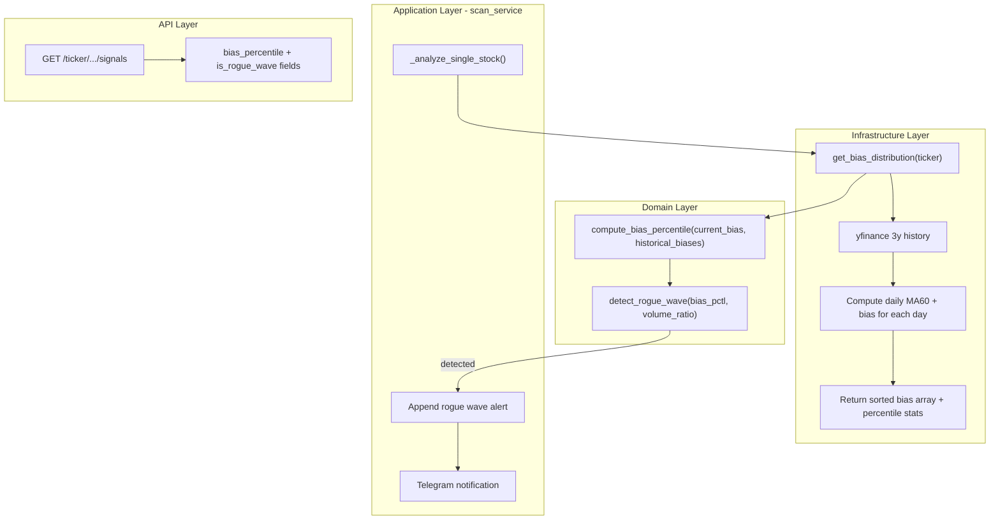

# Rogue Wave (瘋狗浪) & Extreme Sentiment Alert

## Context

The system currently computes bias (乖離率) as `(price - MA60) / MA60 * 100` using **1 year** of data and fires an `OVERHEATED` signal when bias exceeds a fixed 20% threshold. This doesn't account for whether 20% is historically normal for a given stock (e.g., NVDA routinely hits higher bias than a utility stock).

The new feature adds **historical percentile context** to the bias signal and a compound "Rogue Wave" alert when both conditions are met: bias is at a historically extreme level AND volume is surging.

## Key Design Decisions

- **Separate alert layer, not a new ScanSignal**: Rogue Wave is a *warning overlay*, not a replacement for the existing 4-state scan signal. A stock can be `OVERHEATED` AND have a Rogue Wave warning simultaneously.
- **Per-stock percentile**: Percentile is computed against each stock's own 3-year history, making it adaptive.
- **3-year yfinance fetch with 24h cache**: Historical bias distribution changes slowly, so a long cache TTL is appropriate.
- **Notification type**: Reuses the existing `scan_alerts` preference (no new toggle needed).

## Data Flow




---

## Phase 1 -- Domain Pure Functions + Tests

**Goal**: Build the core logic with zero external dependencies. Fully testable in isolation.

**Scope**: 3 files to edit, 1 test file to create.

**Files to touch**:

- `[backend/domain/constants.py](backend/domain/constants.py)` -- Add constants
- `[backend/domain/analysis.py](backend/domain/analysis.py)` -- Add 2 pure functions
- `[backend/tests/domain/test_analysis.py](backend/tests/domain/test_analysis.py)` -- Unit tests

**Constants to add** (`constants.py`):

```python
# Rogue Wave (瘋狗浪) — Historical Bias Percentile Alert
ROGUE_WAVE_HISTORY_PERIOD = "3y"
ROGUE_WAVE_MIN_HISTORY_DAYS = 200
ROGUE_WAVE_BIAS_PERCENTILE = 95       # 95th percentile = extreme overheating
ROGUE_WAVE_VOLUME_RATIO_THRESHOLD = 1.5  # 50% above normal volume
```

**Pure functions to add** (`analysis.py`):

- `compute_bias_percentile(current_bias: float, historical_biases: list[float]) -> Optional[float]`
  - Input: current bias value + a **pre-sorted** list of historical bias values
  - Uses `bisect_left` for O(log n) percentile rank
  - Returns percentile (0.0-100.0), or None if insufficient data
- `detect_rogue_wave(bias_percentile: Optional[float], volume_ratio: Optional[float]) -> bool`
  - Returns True when `bias_percentile >= 95 AND volume_ratio >= 1.5`

**Tests**: Happy path, edge cases (empty history, exact boundary, None inputs, negative bias values).

**Commit**: `feat: add rogue wave domain logic (bias percentile + detection)`

---

## Phase 2 -- Infrastructure Data Fetch

**Goal**: Fetch 3-year historical data from yfinance, compute the bias distribution, and cache it.

**Scope**: 2 files to edit, 1 test file to create.

**Files to touch**:

- `[backend/domain/constants.py](backend/domain/constants.py)` -- Add cache constants
- `[backend/infrastructure/market_data.py](backend/infrastructure/market_data.py)` -- New `get_bias_distribution()`
- `[backend/tests/infrastructure/test_market_data.py](backend/tests/infrastructure/test_market_data.py)` -- Mock tests

**Cache constants to add** (`constants.py`):

```python
ROGUE_WAVE_CACHE_MAXSIZE = 200
ROGUE_WAVE_CACHE_TTL = 86400       # L1: 24 hours
DISK_ROGUE_WAVE_TTL = 172800       # L2: 48 hours
DISK_KEY_ROGUE_WAVE = "rogue_wave"
```

**New function** (`market_data.py`):

- `get_bias_distribution(ticker: str) -> dict`
  - Fetches 3y daily closes via `_yf_history(ticker, ROGUE_WAVE_HISTORY_PERIOD)`
  - Computes rolling MA60, then bias for each day where MA60 is available
  - Returns `{"historical_biases": sorted_list, "count": int, "p95": float, "fetched_at": str}`
  - Uses existing `_cached_fetch` pattern with L1 (TTLCache, 24h) + L2 (diskcache, 48h)
  - Graceful fallback: returns empty dict on yfinance failure

**Follow the existing pattern**: Look at `_fetch_signals_from_yf()` and `_fetch_moat_from_yf()` as templates for the fetcher + cache wrapper.

**Tests**: Mock yfinance, verify bias array is sorted, verify cache keys, verify graceful fallback on empty data.

**Commit**: `feat: add get_bias_distribution() with L1/L2 cache for rogue wave`

---

## Phase 3 -- Scan Integration + API + Backend i18n

**Goal**: Wire rogue wave detection into the scan pipeline, expose via API, and add backend translation keys.

**Scope**: 5 files to edit, 4 locale files to update, 1 test file to update.

**Files to touch**:

- `[backend/application/scan_service.py](backend/application/scan_service.py)` -- Enhance `_analyze_single_stock()`
- `[backend/api/schemas.py](backend/api/schemas.py)` -- Extend `SignalsResponse` + `ScanResult`
- `[backend/api/stock_routes.py](backend/api/stock_routes.py)` -- Pass new fields in signal handler
- `[backend/i18n/locales/zh-TW.json](backend/i18n/locales/zh-TW.json)` -- Add `scan.rogue_wave_alert`
- `[backend/i18n/locales/en.json](backend/i18n/locales/en.json)` -- English translation
- `[backend/i18n/locales/ja.json](backend/i18n/locales/ja.json)` -- Japanese translation
- `[backend/i18n/locales/zh-CN.json](backend/i18n/locales/zh-CN.json)` -- Simplified Chinese translation
- `[backend/tests/application/test_scan_service.py](backend/tests/application/test_scan_service.py)` -- Integration test

**Scan service changes** (`scan_service.py`):

In `_analyze_single_stock()`, after computing the normal signal:

1. Call `get_bias_distribution(ticker)` to get historical bias list
2. Call `compute_bias_percentile(bias, dist["historical_biases"])` to get percentile
3. Call `detect_rogue_wave(percentile, volume_ratio)` to check
4. If detected, append localized alert via `t("scan.rogue_wave_alert", ...)`
5. Include `bias_percentile` and `is_rogue_wave` in the result dict

**Schema changes** (`schemas.py`):

- `SignalsResponse`: Add `bias_percentile: Optional[float] = None`, `is_rogue_wave: bool = False`
- `ScanResult`: Add `bias_percentile: Optional[float] = None`, `is_rogue_wave: bool = False`

**i18n key** (all 4 locales, under `scan`):

- `rogue_wave_alert`: "🌊 {ticker} Rogue Wave: Bias {bias}% at P{percentile}, volume {vol_ratio}x surge. Party peaking -- no leveraged chasing."

**Commit**: `feat: integrate rogue wave detection into scan pipeline and API`

---

## Phase 4 -- Frontend UI

**Goal**: Display bias percentile and rogue wave warning in the stock card UI.

**Scope**: 3 files to edit, 4 locale files to update.

**Files to touch**:

- `[frontend/config.py](frontend/config.py)` -- Add `ROGUE_WAVE_PERCENTILE_UI = 95`
- `[frontend/utils.py](frontend/utils.py)` -- Update `_render_signal_metrics()`
- `[frontend/i18n/locales/zh-TW.json](frontend/i18n/locales/zh-TW.json)`
- `[frontend/i18n/locales/en.json](frontend/i18n/locales/en.json)`
- `[frontend/i18n/locales/ja.json](frontend/i18n/locales/ja.json)`
- `[frontend/i18n/locales/zh-CN.json](frontend/i18n/locales/zh-CN.json)`

**UI changes** (`utils.py`, in `_render_signal_metrics()`):

1. Next to existing bias metric, append percentile tag: e.g. "25.3% (P97)"
  - Color code: orange if >= 90th, red if >= 95th percentile
2. When `is_rogue_wave` is true, render `st.warning()` banner:
  "🌊 Rogue Wave -- bias at historical extreme with volume surge. Party peaking, no leveraged chasing."

**Frontend i18n keys** (under `utils.signals`):

- `bias_percentile`: "P{percentile}"
- `rogue_wave_warning`: Localized warning banner text

**Commit**: `feat: add rogue wave UI display in stock card`

---

## Phase 5 -- Documentation

**Goal**: Update all user-facing documentation to reflect the new feature.

**Scope**: Documentation-only changes.

**Files to touch**:

- `[README.md](README.md)` -- Feature list
- `[docs/agents/folio/SKILL.md](docs/agents/folio/SKILL.md)` -- Agent endpoint docs
- `[docs/agents/AGENTS.md](docs/agents/AGENTS.md)` -- Agent overview
- SOP content in all 4 frontend locale files (the `radar.sop.content` key)

**Commit**: `docs: add rogue wave feature to SOP, README, and agent docs`